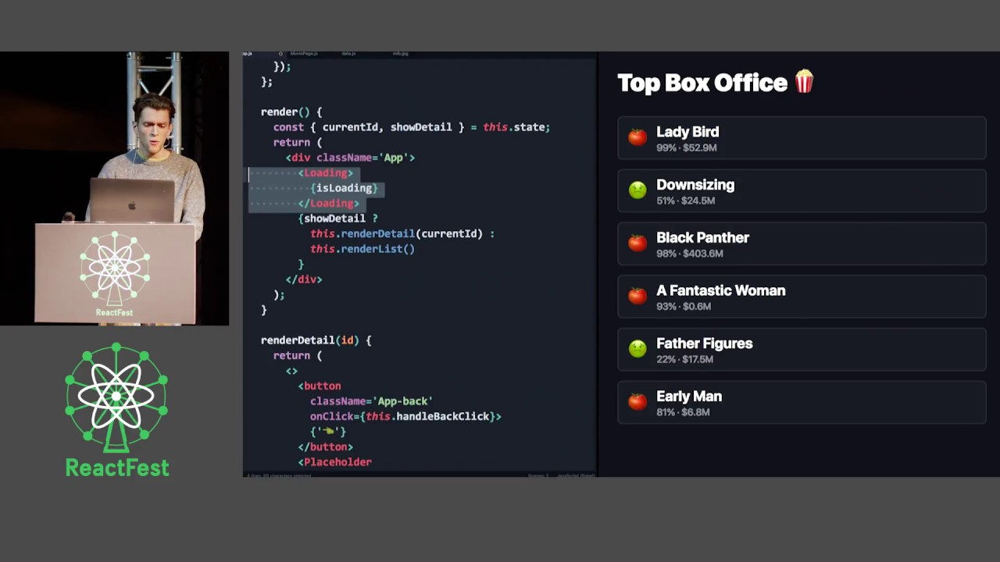
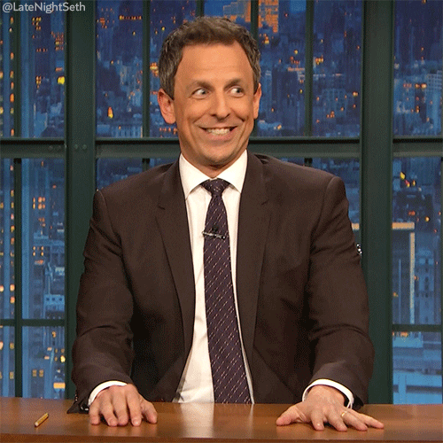
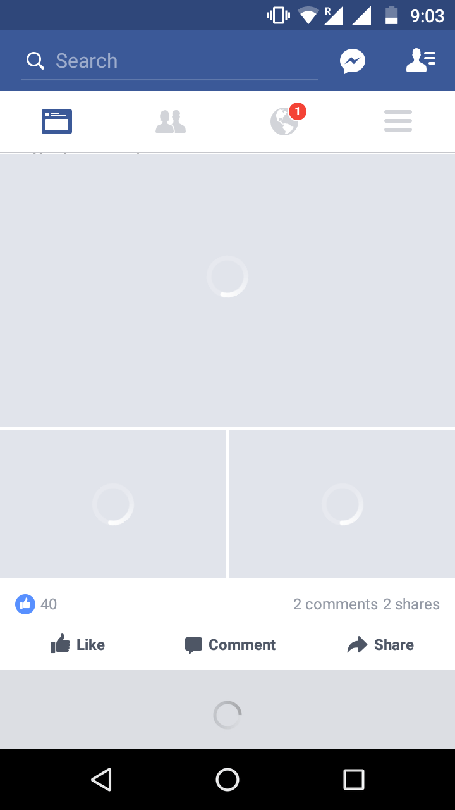
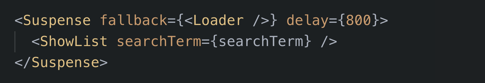

export { notes as theme } from "@mdx-deck/themes";
import { Appear, Notes } from "mdx-deck";
import "./styles.css";

---

# Dustin Myers 🤓

  
  

    
    @dustint314
  

  

---

<h2>React Suspense</h2>
<h5>(For Data Fetching)</h5>

---

## The _Iceland_ Talk! 🤯

---

#### The day after

---

### December 2018 (8 months after Iceland)

---

## React 16 Roadmap blogpost

---

React Suspense <small style={{ fontSize: '40px'}}>(for data fetching)</small> listed as a mid-2019 release

...so, like, right now, right?!?

---

# 🔥⚠️ WRONG! ⚠️🔥

---

### July 2019

---

### Grief Stage - Acceptance

---

## What even is React Suspense for data fetching? 🤔

---

### It's all about user experience

---

### Loading states are hard 😩:

<Appear>
  
</Appear>

---

---

## React Suspense

  <ul>
    <Appear>
      <li>Makes building loading states easy!</li>
      <li>Handles the tough edge cases</li>
      <ul>
        <li>Delayed loading indicator for fast networks</li>
      </ul>
      <ul>
        <li>Multiple unresolved promises</li>
      </ul>
      <li>Caches your API calls!</li>
    </Appear>
  </ul>

---

### What Suspense looks like 🧐:

<Appear>
  
</Appear>

---

### Facebook... We'll be watching you!

---

Let's code! 🚀
